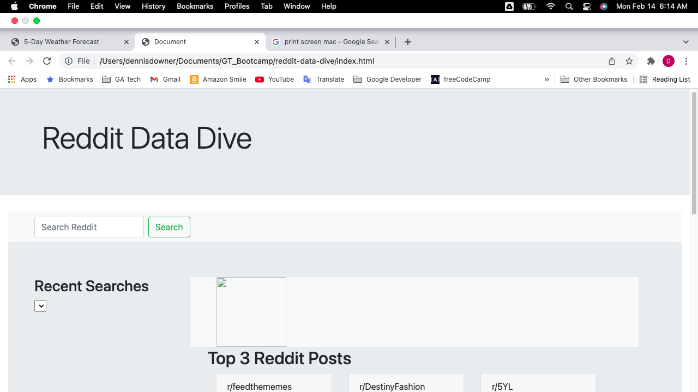

# Reddit Data Dive

## Overview

For our first project, our team conceived and executed a design that solves a real-world problem by integrating data received from multiple server-side API requests. The server-side APIs used in the project were Reddit and Wikipedia.  The first was to search for a topic of interest to see the hottest posts on that particular topic within the last month.  The second was to look up word(s) from the Reddit post title to obtain more information on that topic from Wikipedia.

By working collaboratively, we learned agile development methodologies and implemented feature and bug fixes using git branch workflow and pull requests.

## User Story

```md
AS A curious Reddit user
I WANT to enter a keyword(s) that interests me
SO THAT I can see the three hottest Reddit posts with this term within the last month, and search on Wikipedia for more information on words in the post's title
```

## Acceptance Criteria

```md
GIVEN I am using a search engine to search Reddit posts
WHEN I open the application
THEN I am presented with a search form to enter search criteria
WHEN I enter search criteria
THEN I am presented with the top hottest Reddit posts of the last month
WHEN I view the Reddit posts
THEN I can see the username, title of the post, number of comments, number of upvotes and number of downvotes, and an image if there is one
WHEN I select words in the title
THEN I am presented with a tooltip giving more information on that word(s) from Wikipedia
WHEN I enter search criteria
THEN it is saved in local storage
WHEN I refresh the page
THEN the saved keywords persist
WHEN I click on the button of a recent search term
THEN I am reconnected to Reddit to retrieve the most up-to-date information on that topic
```
## Picture of Deployed Application [placeholder]



## Website of Deployed Application [placeholder for actual site]

https://github.com/AmyWilhoite/reddit-data-dive


